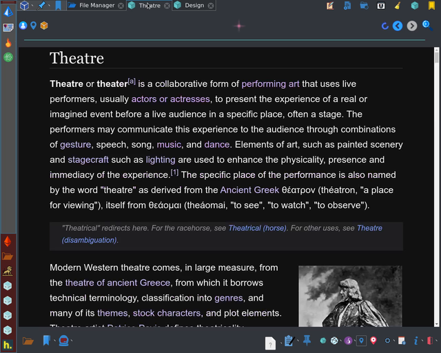

Galacteek
=========

A modest IPFS_ browser

This is a standalone browser allowing you to search, browse, publish and
hashmark content on the permanent web accessible through the IPFS_ peer-to-peer
network.

Installation
============

Installation from source
------------------------

You need to have python 3.5 and pip installed, as well as go-ipfs_. Install with:

.. code-block:: shell

    pip install -r requirements.txt
    python setup.py build install

Now just run the application with:

.. code-block:: shell

    galacteek

Installation from binary
------------------------

If you cannot build from source and want to try a binary, there's a release
available for Linux AMD64 platforms (built with cxFreeze_). There's no guarantee
that they will work on your distribution and building from source is advised.

If you already have IPFS installed on your system you can download the latest
binary release with:

.. code-block:: shell

    ipfs get /ipfs/QmZ8dCfbJBA5aFxbA3UenVkg6Qm8TMcEJUXMw4zSRVdTDp/galacteek-0.1.9-linux-amd64.tar.gz
    tar -xzvf galacteek-0.1.9-linux-amd64.tar.gz

Just go into the unpacked directory and run the **galacteek** program.

If you don't have IPFS installed on your system you can download the same file
directly from here_

.. _here: https://gateway.ipfs.io/ipfs/QmZ8dCfbJBA5aFxbA3UenVkg6Qm8TMcEJUXMw4zSRVdTDp/galacteek-0.1.9-linux-amd64.tar.gz

Installation with Docker
------------------------

A Dockerfile is provided. Build and run the image on Linux with:

.. code-block:: shell

    docker build -t galacteek .
    docker run -e DISPLAY=$DISPLAY -e QTWEBENGINE_DISABLE_SANDBOX=1 -v /tmp/.X11-unix:/tmp/.X11-unix galacteek

Features
========

**galacteek** can either spawn an IPFS daemon and use it as transport, or
connect to an existing IPFS daemon. By default it will try to run a daemon. You
can change the IPFS connection settings through the *Edit* -> *Settings* menu
and restart the application afterwards.

- Browsing sessions with automatic pinning (pins every page you browse)
- Feeds (following IPNS hashes)
- File manager with drag-and-drop support
- Basic built-in media player with IPFS-stored, per-profile playlists
- Search content with the ipfs-search_ search engine
- Decentralized application development/testing with the Javascript API
  (using *window.ipfs*)

Keybindings
===========

Main window keybindings:
------------------------

- **Ctrl+t**: Open a new IPFS browsing tab
- **Ctrl+w**: Close current tab
- **Ctrl+m**: Open the IPFS hashmarks manager
- **Ctrl+f**: Open the file manager
- **Ctrl+o**: Browse IPFS path from the clipboard
- **Ctrl+e**: Explore IPFS path from the clipboard
- **Ctrl+g**: DAG view of IPFS object from the clipboard

Browser keybindings:
--------------------

- **Ctrl+b**: Bookmark current page
- **Ctrl+l**: Load an IPFS CID

IPFS views keybindings (file manager, hash views, dag viewer):
--------------------------------------------------------------

- **Ctrl+h**: Copy selected item's hash (CID) to the clipboard
- **Ctrl+p**: Copy selected item's IPFS path to the clipboard
- **Ctrl+w**: Close tab/hash view

Screenshots
===========

See the screenshots_ directory.

    Browsing the wikipedia IPFS mirror

Platforms supported
===================

Mainly tested on Linux. The application relies heavily on quamash_ which
should work with most platforms.

Contact and donations
=====================

Contact by email at **galacteek@gmx.co.uk**

Donations are welcome and will go to support other projects like ipfs-search_.
You can find donation details in the *Donate* section of the *Help* menu in the
application's main window.

Requirements
============

- go-ipfs_ (install from dist.ipfs.io_)
- python3 >= 3.5
- qt5 (preferrably >5.6)
- PyQt5 with QtWebEngine support
- gstreamer (on Linux) for media player support
- quamash_
- aiohttp_
- aioipfs_

License
=======

**galacteek** is offered under the GNU GPL3 license

Some of the beautiful artwork (under the Creative Commons CC-BY-SA license)
from the ipfs-logo_ project's repository is included, unchanged.

.. _aiohttp: https://pypi.python.org/pypi/aiohttp
.. _aioipfs: https://gitlab.com/cipres/aioipfs
.. _quamash: https://github.com/harvimt/quamash
.. _go-ipfs: https://github.com/ipfs/go-ipfs
.. _dist.ipfs.io: https://dist.ipfs.io
.. _IPFS: https://ipfs.io
.. _ipfs-logo: https://github.com/ipfs/logo
.. _cxFreeze: https://anthony-tuininga.github.io/cx_Freeze/
.. _screenshots: https://gitlab.com/galacteek/galacteek/tree/master/screenshots
.. _ipfs-search: https://ipfs-search.com
