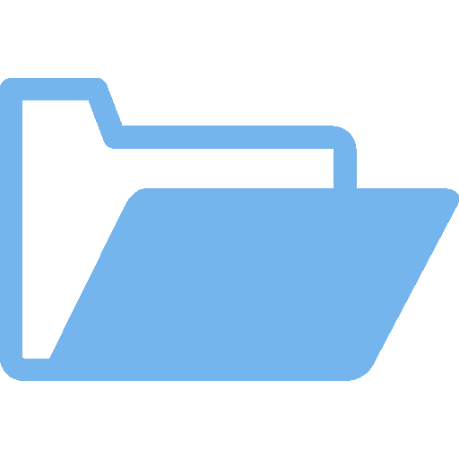
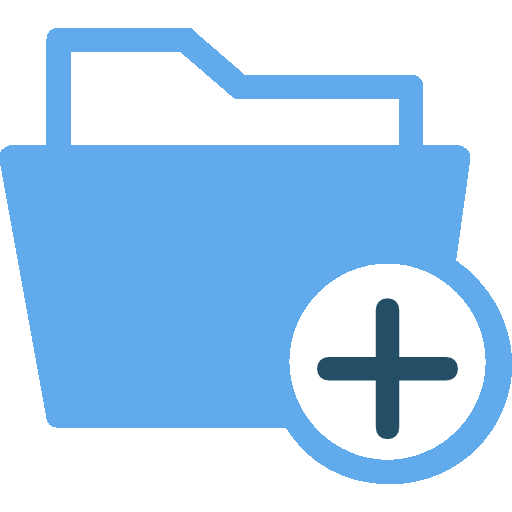

File manager
============

By clicking on the folder icon below the window's menu you'll get access to the
file manager for importing content in the IPFS repository. With IPFS all your
data is addressed by its content and referenced by its cryptographic hash 
(e.g *Qmb9uWkLmiFNEhp6PyV5iw4qh5wsv2dtJNGwUi1k15JwJd*)

Selecting the working directory
-------------------------------

The path selector menu lets you select the current working directory. *Home* is
the default directory.

Importing your files using the files selection dialogs
------------------------------------------------------

If you click on the **Add files** icon you are prompted with a file selection
dialog. All files selected will be imported to your IPFS repository. By default
your files will be wrapped with a directory in order to preserve filenames (you
can change this in the settings).

If you click on the **Add directory** icon you are prompted with a selection
dialog for directories only. This will recursively import the directory,
including dotfiles (files and directories starting with *.* on Linux)

Because the application accesses IPFS in an *asynchronous* manner, importing
even large amounts of data should not cause the application to hang or becoming
unresponsive so you can perform other tasks meanwhile, but the file manager
will prevent you from adding more content while the import is running.

Importing your files using the local file manager (drag-and-drop)
-----------------------------------------------------------------

Clicking on the file manager icon will open up a file manager displaying your
local files. Just select and drag-and-drop your files from the local file
manager to the IPFS file manager on the left and they will be imported to your
repository. Multiple selection is supported by holding the *Control* or *Shift*
keys.

Drag-and-dropping content from other applications is supported as well.

Double-clicking items
---------------------

Double-clicking a file will open a browser tab, while double-clicking a directory
will expand it.

Right-clicking items
--------------------

Right-clicking an entry in the file manager will popup a menu giving you a few
options:

- *Copy the selected file's IPFS hash to the clipboard*
- *Unlink*: this will dereference the item but not delete it (i.e. the
  content will still be available through your IPFS node)
- *Delete*: purge from your IPFS node (**note**: if others have *pinned* this
  data on their node, it will still be available)
- *Hashmark*: bookmark the IPFS hash associated with the file
- *Browse*: open a browser tab for this file 
- *Explore*: for directories, open an explorer tab for this entry
- *Open with*: use specific application/method to open this file (mediaplayer,
  ebook..)
- *Publish to IPNS key*: this will link this file to the given IPNS key

Keyboard shortcuts
------------------

The following keyboard shortcuts are available within the files manager:

- **Ctrl+h**: Copy item's hash to the clipboard
- **Ctrl+p**: Copy item's path (full IPFS path) to the clipboard
- **Ctrl+x**: Explore item if it is a directory
