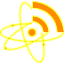

.. _atom:

Atom feeds
==========

There is support for subscribing to Atom feeds on the dweb
(it will only work with feeds that are hosted on IPFS,
for example from your profile's Atom feed).

When you subscribe to an Atom feed on the dweb, by default
the entries contained in the feed will automatically be pinned
to your node.

Profile's feed
--------------

Your profile has a DAG associated with it, that gets updated
when the profile's website (the blog for example) changes. Your
website has an Atom feed attached to it, so that others can
easily follow what you post.

Subscribing to a feed
---------------------

From a peer
^^^^^^^^^^^

Open the peers manager and for the peer that you want to follow,
select *Follow (Atom feed)*.

From a URL
^^^^^^^^^^

From the toolbar, click on the Atom icon which will open the Atom feeds view,
and select *Subscribe to an Atom feed from URL*.

You can also just copy the IPFS feed's path/URL to the clipboard, and from the
clipboard item button select *Subscribe to Atom feed*

From the browser
^^^^^^^^^^^^^^^^

If you come across a link to an Atom feed on a webpage, just right-click the
link and select *Follow Atom feed*
