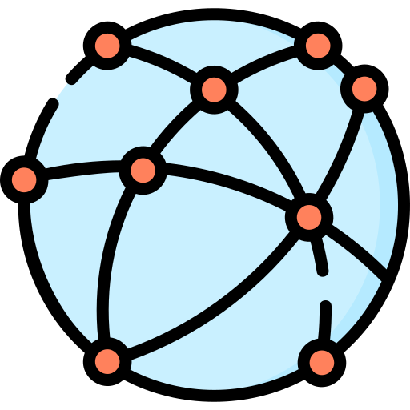

IPFS networks
=============

The main IPFS network is the default network that an
IPFS node will connect to.

Given the large size of the main network, there can be a
significant performance cost associated with the necessity
of maintaining network connections with so many peers.

Luckily, IPFS supports *private networks*, where
nodes within the private network use a common private
:term:`swarm key` and only communicate with the peers
that possess this key. This has many advantages,
one of them being better node performance.

*galacteek* supports switching between the different
available IPFS networks. Note that you can only change
the IPFS network if you're connecting with a local
IPFS daemon, as this requires writing the *swarm key*
in the repository.

How to change the IPFS network
------------------------------

In the statusbar (bottom-right), next to the rotating
IPFS cube button, there's a button to select the *IPFS network*.
Click on this button and select the network you want to join.
