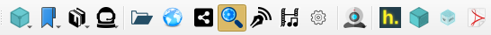

Toolbars
========

Main toolbar
------------

The window's main toolbar can be moved (using the handle) to
the left side of the screen (vertical position) or to the top
(horizontal position, the default).

The left side of the toolbar offers the following controls
(from left to right):

- Browse button
- Local and shared :ref:`hashmarks`
- Filemanager and mediaplayer
- Peers, profile and chat
- Quick access section

Quick access
^^^^^^^^^^^^

In this part of the toolbar you can drag and drop IPFS objects and apps
that you want to have quick access to. If there's no existing hashmark
for the object dropped you'll be asked if you want it to be hashmarked
(this is not mandatory, but creating a hashmark with a custom icon
will make the item more easily recognizable).

If you want to remove an item from the quickaccess bar, right-click the
item and click *Remove*.

.. image:: _static/maintoolbar-2.png
    :width: 271
    :height: 40

The right side of the toolbar offers the following controls:

- IPFS search
- Current clipboard item and clipboard manager
- Global pinning button
- Settings and tools menu
- Information menu
