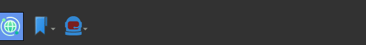

.. _workspaces:

Workspaces
==========

From the main toolbar (appearing at the bottom of the screen)
you can access the different workspaces just by hovering the
first button in the toolbar (with a blue background).

Each workspace has a different purpose and contains a list of tabs
(some tabs are long-lived and cannot be closed, like the
filemanager).

Main workspace
--------------

.. image:: ../../../../share/icons/planets/globe-grid.png
   :width: 64
   :height: 64

Where the bulk of the action happens. 

Specific workspace keyboard shortcuts 
-------------------------------------

- **Mod + s**: Search content on the dweb

*Mod* is the *Control Left* key on Linux and the *Command* key on MacOS X.
*Mod* is the *Left Control* key on Linux and the *Command* key on MacOS X.

Files workspace
---------------

.. image:: ../../../../share/icons/folder-open.png
   :width: 64
   :height: 64

This workspace hosts the filemanager. Anything opened by the
filemanager will appear on this workspace.

Edition workspace
-----------------

This workspace contains tools (text editor, blog post writer)
to write documents stored on IPFS.

Network workspace
-----------------

This workspace shows the peers you're connecting with, letting you
explore the :term:`DID services`.

From here you can also use the dweb Atom feeds reader and connect
to chat rooms.

Multimedia workspace
--------------------

This workspace hosts the mediaplayer.
